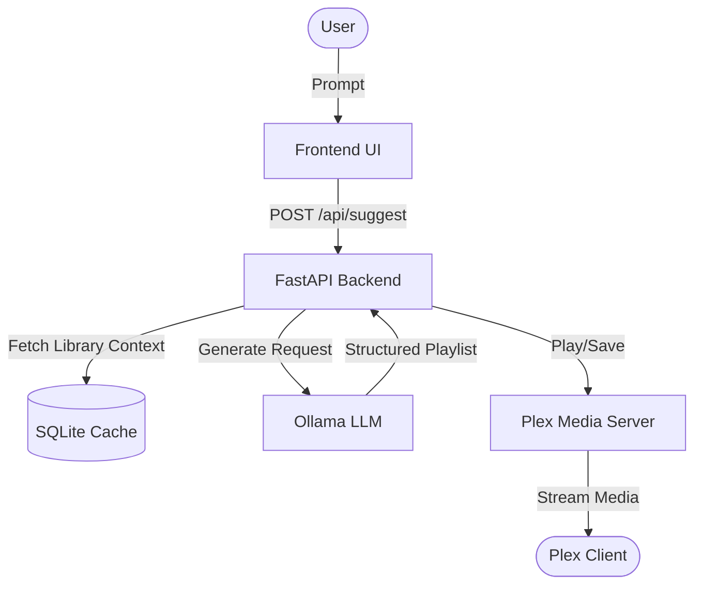

# Plex Playlist

**Intelligent Semantic Music Orchestrator**

Plex Playlist is a middleware application that brings natural-language playlist generation to your local Plex Music library. It uses Ollama to perform LLM inference, pulling context directly from your Plex metadata, and can trigger playback on your Plex clients.

## Features

- **Natural Language Prompts:** Describe what you want ("upbeat 90s rock for a workout", "chill evening vibes") and get a tailored playlist.
- **Local Inference:** Fully private using Ollama, pulling no external data.
- **Direct Playback:** Dispatches playlists straight to your chosen Plex client.
- **Automatic Sync:** Syncs your music library metadata on first start.

## Architecture



## Prerequisites

- **Docker & Docker Compose**
- **NVIDIA Container Toolkit** (for GPU acceleration with Ollama)
- A **Plex Token** (to authenticate with your Plex Server)
- **Ollama** installed or accessible

## Setup Instructions

1. **Clone the repository:**
   ```bash
   git clone https://github.com/vitreous99/plex_playlist.git
   cd plex_playlist
   ```

2. **Configure environment:**
   Copy the example environment file and fill in your details:
   ```bash
   cp .env.example .env
   # Edit .env with your favorite editor
   nano .env
   ```
   *Make sure you provide your `PLEX_URL` and `PLEX_TOKEN`.*

3. **Start the application:**
   ```bash
   docker-compose up -d
   ```

4. **Access the application:**
   Open your browser and navigate to: `http://localhost:3000`

## Usage Guide

1. **Wait for Sync:** On first startup, the app will automatically sync your Plex library metadata. You can monitor the progress on the top right of the UI.
2. **Select Device:** Choose your playback device from the dropdown.
3. **Generate:** Type in a prompt (e.g., "Mellow acoustic covers") and hit **Generate**.
4. **Play/Save:** Review the generated playlist. Click **Play** to start streaming to your client, or **Save** to add it to your Plex Playlists permanently.

## Troubleshooting FAQ

- **GPU not detected:** Ensure the NVIDIA Container Toolkit is installed and configured for Docker.
- **Client not found:** Ensure your Plex client is currently active on your network and not asleep (e.g., wake up your Apple TV or Shield).
- **Empty library / No tracks:** Ensure your Plex server has a Music library and that the initial sync completed successfully.

